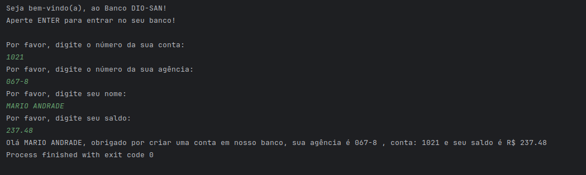

# DIO - Trilha Java Básico - DESAFIO

---
## Sintaxe - Desafio 

---

### Descrição

O projeto ContaBanco receberá dados via terminal contendo as características de conta em banco conforme atributos abaixo:

- **Número**: Inteiro (Exemplo: 1021)
- **Agência**: Texto (Exemplo: 067-8)
- **Nome do Cliente**: Texto (Exemplo: MARIO ANDRADE)
- **Saldo**: Decimal (Exemplo: 237.48)

### Classe ContaTerminal.java

A classe `ContaTerminal.java` será responsável por toda a codificação do programa. Ela permitirá que os dados sejam inseridos via terminal, onde o usuário receberá a mensagem de qual informação será solicitada, como por exemplo:

java
System.out.println("Por favor, digite o número da Agência:");

Depois de todas as informações terem sido inseridas, o sistema exibirá a seguinte mensagem:

java

System.out.println("Olá [Nome Cliente], obrigado por criar uma conta em nosso banco, sua agência é [Agencia], conta [Numero] e seu saldo [Saldo] já está disponível para saque.");

Os campos entre [ ] serão substituídos pelas informações inseridas pelos usuários.

---

# [Texto do Desafio no GitHub da DIO](https://github.com/digitalinnovationone/trilha-java-basico/blob/main/desafios/sintaxe/README.md)

---

## Print do desafio no meu terminal
